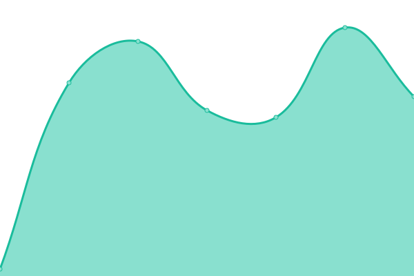

# [📈 Live Status](https://webstatus.slqwq.cn): <!--live status--> **🟧 Partial outage**

This repository contains the open-source uptime monitor and status page for [hajeekn-co](https://webstatus.slqwq.cn), powered by [Upptime](https://github.com/upptime/upptime).

With [Upptime](https://upptime.js.org), you can get your own unlimited and free uptime monitor and status page, powered entirely by a GitHub repository. We use [Issues](https://github.com/hajeekn-co/testweb/issues) as incident reports, [Actions](https://github.com/hajeekn-co/testweb/actions) as uptime monitors, and [Pages](https://webstatus.slqwq.cn) for the status page.

<!--start: status pages-->
<!-- This summary is generated by Upptime (https://github.com/upptime/upptime) -->
<!-- Do not edit this manually, your changes will be overwritten -->
<!-- prettier-ignore -->
| URL | Status | History | Response Time | Uptime |
| --- | ------ | ------- | ------------- | ------ |
|  [Main Blog](https://blog.slqwq.cn) | 🟩 Up | [main-blog.yml](https://github.com/hajeekn-co/testweb/commits/HEAD/history/main-blog.yml) | 

 663ms
     
 | 

<a href="https://webstatus.slqwq.cn/history/main-blog">100.00%</a>
    

|  [HomePage](https://slqwq.cn) | 🟥 Down | [home-page.yml](https://github.com/hajeekn-co/testweb/commits/HEAD/history/home-page.yml) | 

 0ms
     
 | 

<a href="https://webstatus.slqwq.cn/history/home-page">100.00%</a>
    

|  [Other CDN](https://moecdn.slqwq.cn) | 🟥 Down | [other-cdn.yml](https://github.com/hajeekn-co/testweb/commits/HEAD/history/other-cdn.yml) | 

 0ms
     
 | 

<a href="https://webstatus.slqwq.cn/history/other-cdn">100.00%</a>
    

|  [Static Files CDN](https://static.slqwq.cn) | 🟥 Down | [static-files-cdn.yml](https://github.com/hajeekn-co/testweb/commits/HEAD/history/static-files-cdn.yml) | 

 0ms
     
 | 

<a href="https://webstatus.slqwq.cn/history/static-files-cdn">100.00%</a>
    

|  [Static Files CDN Two](https://static-2.slqwq.cn) | 🟥 Down | [static-files-cdn-two.yml](https://github.com/hajeekn-co/testweb/commits/HEAD/history/static-files-cdn-two.yml) | 

 0ms
     
 | 

<a href="https://webstatus.slqwq.cn/history/static-files-cdn-two">100.00%</a>
    

|  [Static Files CDN Three](https://static-3.slqwq.cn) | 🟥 Down | [static-files-cdn-three.yml](https://github.com/hajeekn-co/testweb/commits/HEAD/history/static-files-cdn-three.yml) | 

 0ms
     
 | 

<a href="https://webstatus.slqwq.cn/history/static-files-cdn-three">100.00%</a>
    

|  [Unpkg Mirrors](https://unpkg.slqwq.cn) | 🟩 Up | [unpkg-mirrors.yml](https://github.com/hajeekn-co/testweb/commits/HEAD/history/unpkg-mirrors.yml) | 

 212ms
     
 | 

<a href="https://webstatus.slqwq.cn/history/unpkg-mirrors">100.00%</a>
    

|  [Comments API](https://comments.api.slqwq.cn) | 🟩 Up | [comments-api.yml](https://github.com/hajeekn-co/testweb/commits/HEAD/history/comments-api.yml) | 

 3570ms
     
 | 

<a href="https://webstatus.slqwq.cn/history/comments-api">100.00%</a>
    

|  [Main Blog (Test for HEAD)](https://blog.slqwq.cn) | 🟥 Down | [main-blog-test-for-head.yml](https://github.com/hajeekn-co/testweb/commits/HEAD/history/main-blog-test-for-head.yml) | 

 0ms
     
 | 

<a href="https://webstatus.slqwq.cn/history/main-blog-test-for-head">100.00%</a>
    

|  [HomePage (Test for HEAD)](https://slqwq.cn) | 🟥 Down | [home-page-test-for-head.yml](https://github.com/hajeekn-co/testweb/commits/HEAD/history/home-page-test-for-head.yml) | 

 0ms
     
 | 

<a href="https://webstatus.slqwq.cn/history/home-page-test-for-head">100.00%</a>
    

|  [Other CDN (Test for HEAD)](https://moecdn.slqwq.cn) | 🟥 Down | [other-cdn-test-for-head.yml](https://github.com/hajeekn-co/testweb/commits/HEAD/history/other-cdn-test-for-head.yml) | 

 0ms
     
 | 

<a href="https://webstatus.slqwq.cn/history/other-cdn-test-for-head">100.00%</a>
    

|  [Static Files CDN (Test for HEAD)](https://static.slqwq.cn) | 🟥 Down | [static-files-cdn-test-for-head.yml](https://github.com/hajeekn-co/testweb/commits/HEAD/history/static-files-cdn-test-for-head.yml) | 

 0ms
     
 | 

<a href="https://webstatus.slqwq.cn/history/static-files-cdn-test-for-head">100.00%</a>
    

|  [Static Files CDN Two (Test for HEAD)](https://static-2.slqwq.cn) | 🟥 Down | [static-files-cdn-two-test-for-head.yml](https://github.com/hajeekn-co/testweb/commits/HEAD/history/static-files-cdn-two-test-for-head.yml) | 

 0ms
     
 | 

<a href="https://webstatus.slqwq.cn/history/static-files-cdn-two-test-for-head">100.00%</a>
    

|  [Static Files CDN Three (Test for HEAD)](https://static-3.slqwq.cn) | 🟥 Down | [static-files-cdn-three-test-for-head.yml](https://github.com/hajeekn-co/testweb/commits/HEAD/history/static-files-cdn-three-test-for-head.yml) | 

 0ms
     
 | 

<a href="https://webstatus.slqwq.cn/history/static-files-cdn-three-test-for-head">100.00%</a>
    

|  [Unpkg Mirrors (Test for HEAD)](https://unpkg.slqwq.cn) | 🟩 Up | [unpkg-mirrors-test-for-head.yml](https://github.com/hajeekn-co/testweb/commits/HEAD/history/unpkg-mirrors-test-for-head.yml) | 

 27ms
     
 | 

<a href="https://webstatus.slqwq.cn/history/unpkg-mirrors-test-for-head">100.00%</a>
    

|  [Comments API (Test for HEAD)](https://comments.api.slqwq.cn) | 🟩 Up | [comments-api-test-for-head.yml](https://github.com/hajeekn-co/testweb/commits/HEAD/history/comments-api-test-for-head.yml) | 

 118ms
     
 | 

<a href="https://webstatus.slqwq.cn/history/comments-api-test-for-head">100.00%</a>
    

<!--end: status pages-->

[**Visit our status website →**](https://webstatus.slqwq.cn)

## 📄 License

- Powered by: [Upptime](https://github.com/upptime/upptime)
- Code: [MIT](./LICENSE) © [hajeekn-co](https://webstatus.slqwq.cn)
- Data in the `./history` directory: [Open Database License](https://opendatacommons.org/licenses/odbl/1-0/)
